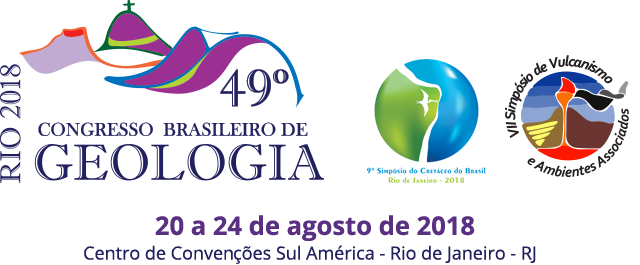

#Congresso_Brasileiro_Geologia2018

  

## Objetivo
  Criar um programa que gera modelo geofísico através do cálculo de massas pontuais.

## Referências online:
 
- [LNC](http://lcn.epfl.ch/tutorial/english/index.html)
- [Sotware Carpentry](https://software-carpentry.org/)
- [Ipython](https://plot.ly/ipython-notebooks/)
- [Overleaf](https://www.overleaf.com/latex/templates/)
- [Tensor Flow](https://www.tensorflow.org/)
- [Anaconda](https://www.continuum.io/)

