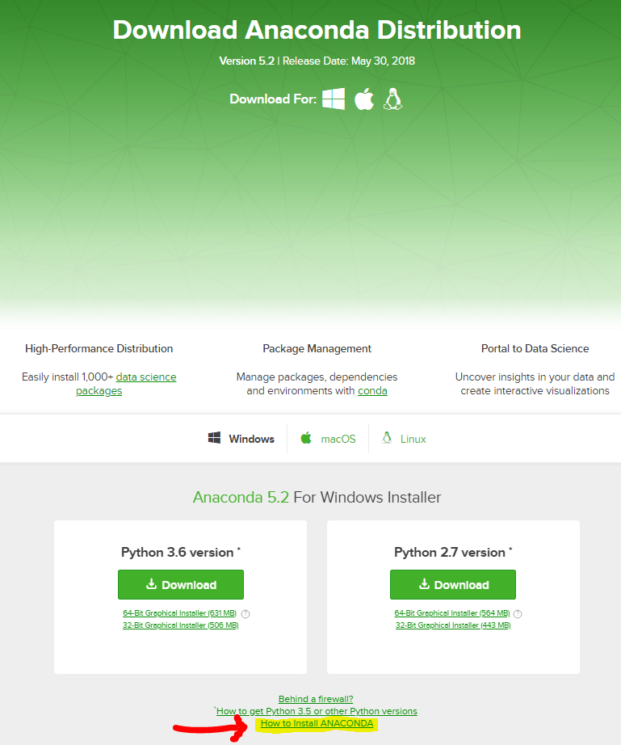
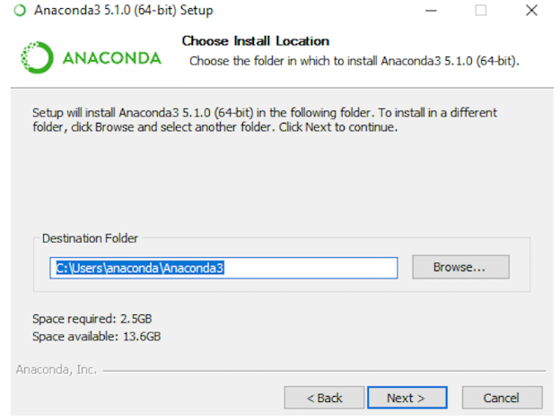
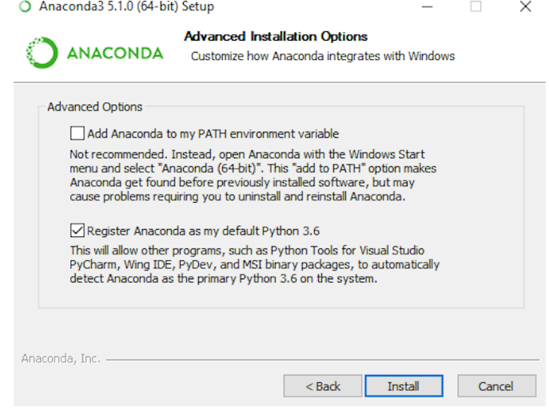
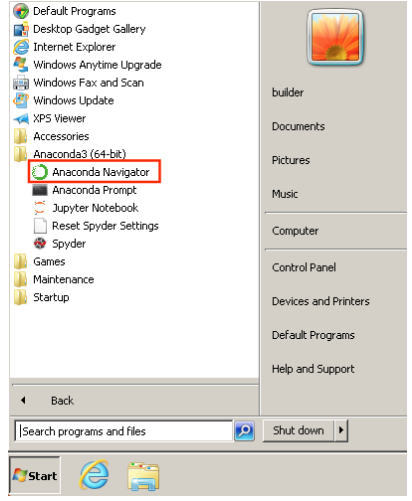
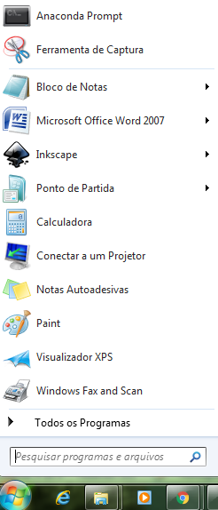
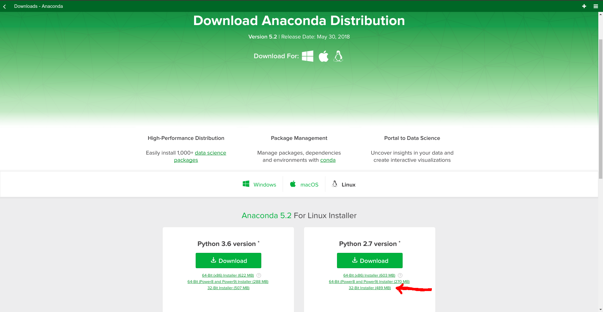
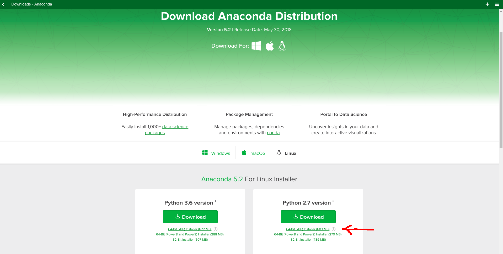

# Tutorial de instalação:

Este repositório apresenta o procedimento de instalação das dependências necessárias para rodar o programa apresentado no curso Modelagem gravimétrica utilizando fontes pontuais formalmente publicado no 49o Congresso brasileiro de geologia de 20 a 24 de agosto no centro de convenções Sul América - Rio de Janeiro - RJ.

## Instrução para a instalação dos pacotes necessários no Windows:  

Clique em [Anaconda](https://www.continuum.io/) para ser redirecionado para a página de download. Neste link há versões de instalação do anaconda em diversas plataformas (Linux, macOS e Windows). Verifique se o sistema operacional instalado em sua máquina opera com 32 ou 64 bits e em seguida defina a versão do python que deseja instalar (versões 2.7 e 3.6) e faça o download do Anaconda installer. Este curso utiliza a versão padrão do Python 2.7. Para mais detalhes, acesse o tutorial oficial, destacado na figura.

** Observação: Se você encontrar dificuldades durante a instalação, desabilite momentaneamente o software de anti-virus, faça a instalação do Anaconda installer e então reabilite o anti-virus. **

  

* Localize o instalador e então faça um clique duplo para iniciar a instalação. Para evitar erros de permissão, NÃO COLOQUE O INSTALADOR NA PASTA FAVORITOS. 

* Leia os termos de licença e clique em "I Agree" (Eu aceito)

* Selecione a instalação em modo "Just me" (Somente eu) para o caso de computador privado. 

* Defina a pasta de destino onde o anaconda será instalado e clique em "Next" (Próximo). Define o nome do diretório sem ESPAÇOS OU caracteres UNICODES. 

  

* Na aba de "Advanced Installation Options" (Opções de Instalação avançada), selecione "Register Anaconda as my default Python (número da versão) .  Clique em "Install" (instalar). Para visualizar os pacotes que estão sendo instalados, clique em "Show details".

  

* Esta etapa pode ser ignorada. Basta clicar em "skip" (pular). 

  

* Pronto! Agora basta procurar pelo diretório onde foi instalado o anaconda e abrir o anaconda navigator. Já estamos prontos para navegar pelos aplicativos disponibilizados pelo anaconda. Se você preferir utilizar o terminal via Anaconda Prompt, basta abrir um terminal e digitar o comando jupyter notebook, que então uma tela do seu navegador de internet padrão abrirá e o jupyter noteboook estará pronto para ser utilizado!

  

# Pacotes Extras: BASEMAP

* Abra um terminal utilizando o Anaconda Prompt, localizado no topo do menu INICIAR:

  

* digite o seguinte comando:

 " conda install basemap "

Em seguida, após um certo tempo, surgirá uma lista de pacotes que serão atualizados e desatualizados. confirme (teclando 'y', de yes).Aguarde a instalação e verifique a porcentagem de todas as atualizações, a fim de ter a certeza de que todos os pacotes e dependências tenham sido adequadamente atualizados. 

## Instrução para a instalação dos pacotes necessários no Linux:

Clique em [Anaconda](https://www.continuum.io/) para ser redirecionado para a página de download. 

* Ao abrir a página clique em Downloads 

  

* Abra um terminal digitando no teclado "Crt+Alt+T" e certifique se seu sistema operacional é 32 bits ou 64 bits com o comando "uname -m".

* Para sistemas 32 bits vá para "Python 2.7 version" clique em 

  

* Para sistemas 64 bits vá para "Python 2.7 version" clique em 

  

* Verifique a integridade do dado rodando o comando "md5sum /path/filename" ou "sha256sum /path/filename".

* Entre com o comando "bash ~/Downloads/Anaconda2-5.2.0-Linux-x86_64.sh" para instalar o Anaconda para a versão Python 2.7.

OBS: É necessário que o arquivo "Anaconda2-5.2.0-Linux-x86_64.sh" esteja na pasta de Downloads.

* Escolha a opção "Install Anaconda as a user".

* O prompt de instalação irá pedir para que o usuário leia os termos de lincença. 

* Após a leitura aperte "YES" para concordar. 

* Clique em "accept" para aceitar o local de instalação padrão. Em seguida, será mostrado no display "PREFIX=/home/<user>/anaconda<2 or 3>".
    
* Será perguntado ao usuário se o instalador pode criar a dependência do "Anaconda<2 or 3>" no caminho "home/<user>/.bashrc"

* Será perguntado ao usuário se ele deseja instalar o VS Coden da Microsoft. Escolha "YES" ou "NO".

* Depois disso a instalação será concluída. Em seguida feche e abra novamente o terminal para que a instalação tenha efeito ou digite "source ~/.bashrc".

* Confirme se a instalação foi bem sucedida digitando "anaconda-navigator", no terminal. Caso o navegador abra os pacotes e programas estão prontos para uso.

# Pacotes Extras: BASEMAP

O Basemap é um pacote open source que compila diversas fontes de dados de mapas. Para instalá-lo o usuário deve digitar no terminal "conda install basemap".
